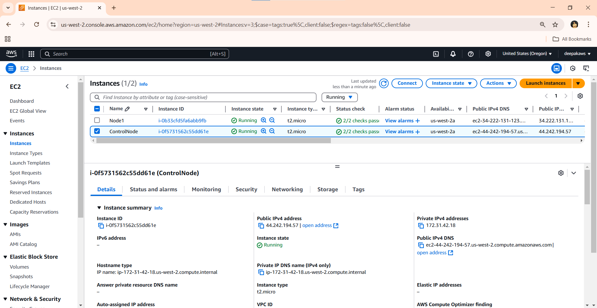
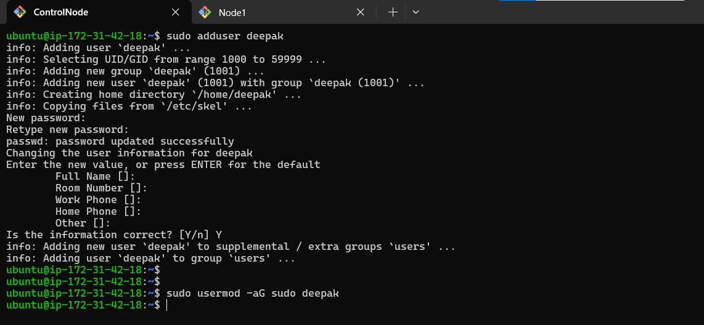
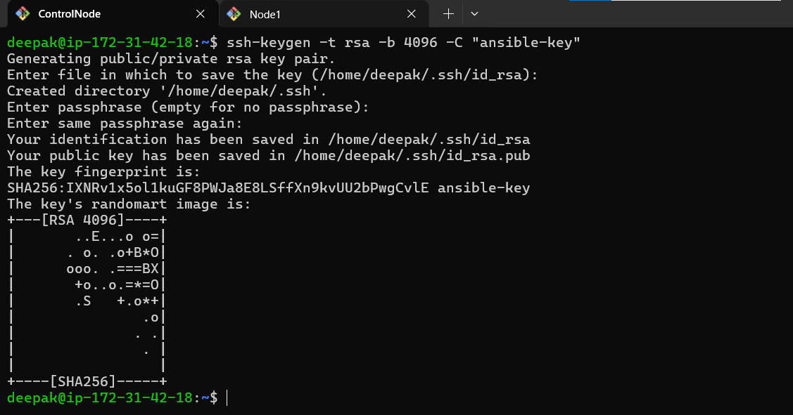
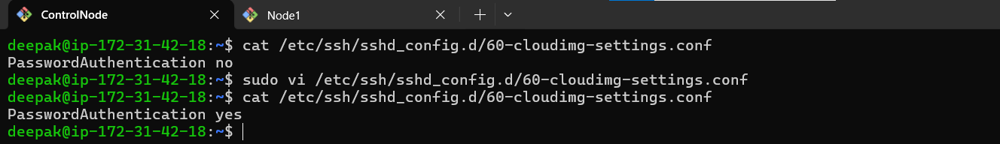
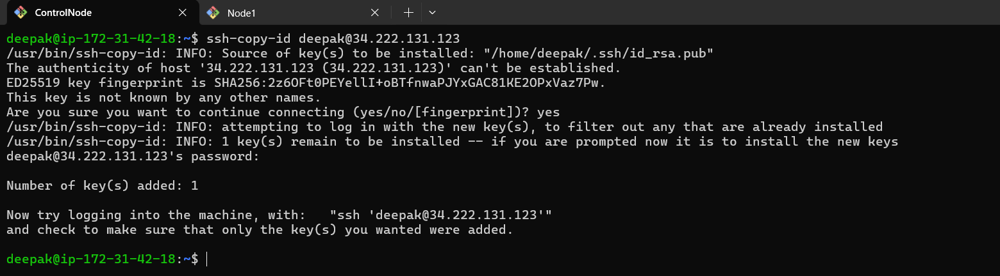
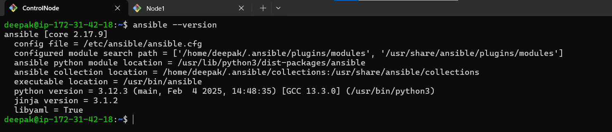
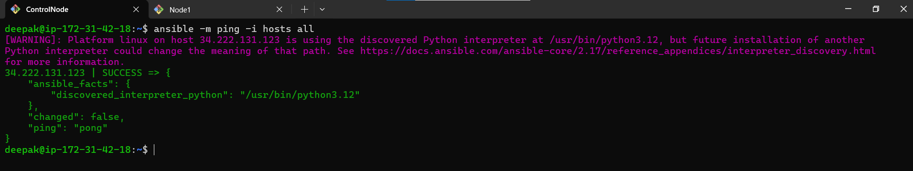

# Installing Ansible and Verifying Key-Based Authentication

This project demonstrates setting up Ansible on a control node and configuring key-based authentication between two EC2 instances in different VPCs. It also includes troubleshooting steps for common SSH authentication issues.

## Steps to Follow

### 1. Create Two EC2 Instances in Separate VPCs

- Launch two EC2 instances (`Control Node` and `Node1`) in separate VPCs using the Ubuntu AMI.
- Ensure security groups allow SSH access between the instances.

   

### 2. Create a New User in both Machines

- Create a new user `deepak` on both machines:
  ```bash
  sudo adduser deepak
  sudo usermod -aG sudo deepak
  ```
   

- Edit sudo permissions:
  ```bash
  sudo visudo
  ```
  Add the following line at the end:
  ```bash
  deepak ALL=(ALL:ALL) NOPASSWD:ALL
  ```
- NOTE: We can go with the default Username also, but we go with created users for best practices  


### 3. Generate SSH Key on the Control Node

- Run the following command on the control node to generate an SSH key:
  ```bash
  ssh-keygen -t rsa -b 4096 -C "ansible-key"
  ```
   

### 5. Copy SSH Key to Node1

- Attempt copying the SSH key:
  ```bash
  ssh-copy-id deepak@34.222.131.123
  ```
- If it fails due to password authentication being disabled, modify the SSH configuration.


### 6. Enable Password Authentication Temporarily

- On Node1, edit the SSH configuration file:
  ```bash
  sudo vi /etc/ssh/sshd_config.d/60-clouding-settings.conf
  ```
  Change:
  ```bash
  PasswordAuthentication yes
  ```
- Restart SSH service:
  ```bash
  sudo systemctl daemon-reload
  sudo systemctl restart ssh
  ```

  

### 7. Copy SSH Key Again

- Run:
  ```bash
  ssh-copy-id deepak@34.222.131.123
  ```
    

- Public key is stored in authorized_keys in node1 home directory
- Once the key is copied, disable password authentication again for security:
  ```bash
  sudo nano /etc/ssh/sshd_config.d/60-cloudimg-settings.conf
  ```
  Set it back to:
  ```bash
  PasswordAuthentication no
  ```
- Restart SSH again:
  ```bash
  sudo systemctl restart ssh
  ```

### 8. Install Ansible on the Control Node

- Update packages and install Ansible:
  ```bash
   sudo apt update -y
   sudo apt install software-properties-common -y
   sudo apt install python3 python3-pip -y
   sudo apt install software-properties-common
   sudo add-apt-repository --yes --update ppa:ansible/ansible
   sudo apt install ansible -y
  ```

### Verify Anaible Installation
  
   ```sh
     ansible --version
   ```


### 9. Configure Ansible Inventory File

- Create a hosts file:
  ```bash
  vi hosts
  ```
  Add the following content:
  ```ini
   34.222.131.123
  ```

### 10. Test Ansible Connection

- Run the following command to verify Ansible setup:
  ```bash
  ansible -m ping -i hosts all
  ```
   

## Common Errors and Resolutions

1. **Permission denied (publickey)**

   - Ensure the SSH key is correctly copied to Node1.
   - Verify that you are using the correct user (`deepak` instead of `ubuntu`).

2. **SSH Key Copy Fails**

   - Temporarily enable password authentication to allow key copying.

3. **Ansible Ping Fails**

   - Ensure SSH connectivity is working.
   - Check sudo permissions for `deepak`.

This completes the project setup! 

