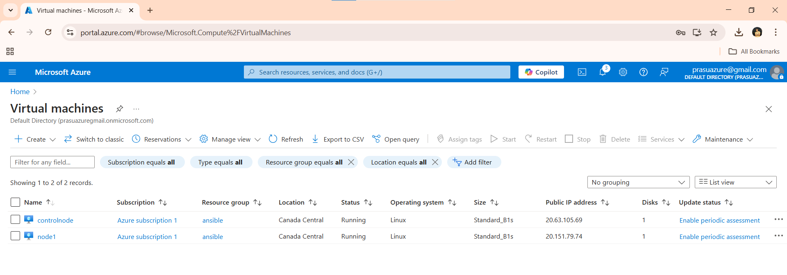
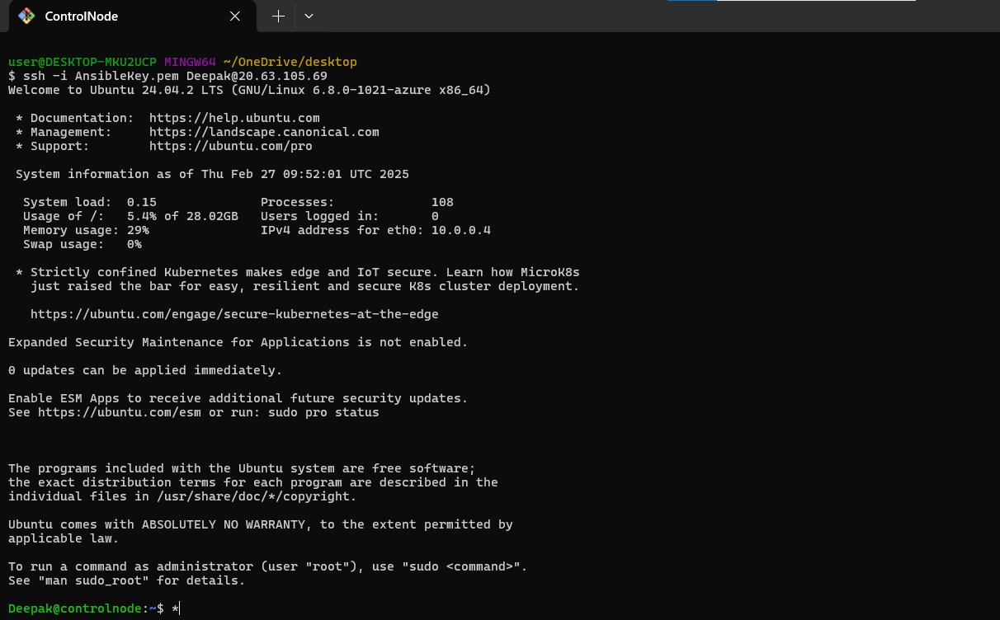
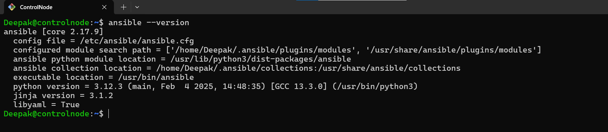
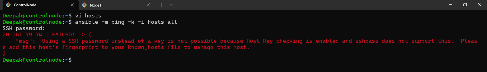
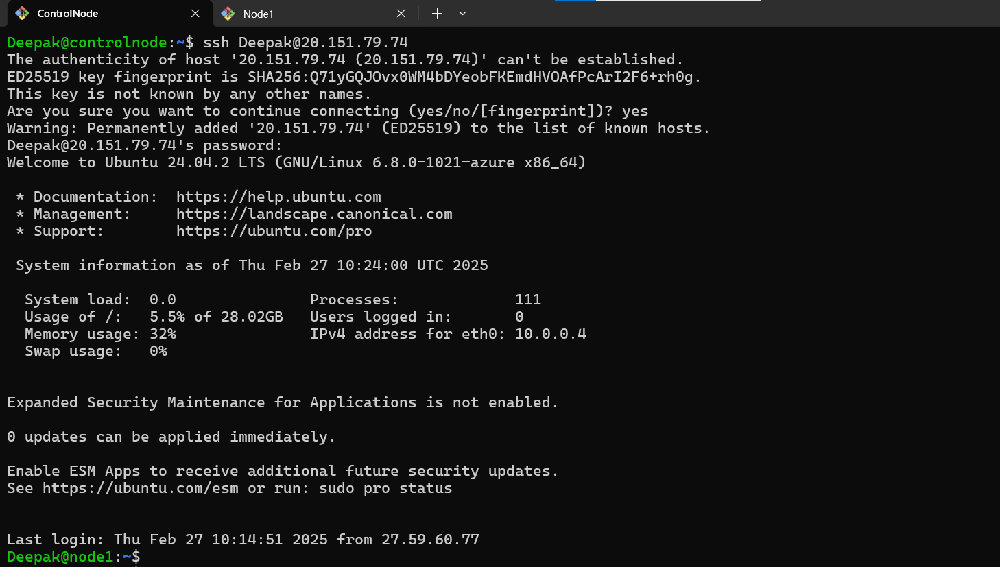

# Ansible Installation on VM (Control Node & Managed Node)

## Project Overview
This project demonstrates the installation of **Ansible** on a control node, setting up a managed node, configuring **password-based authentication**, and verifying the connection using Ansible inventory.

---
## Prerequisites
- **Two Virtual Machines (VMs)** 
  - **Control Node** (where Ansible is installed)
  - **Managed Node** (which Ansible will manage)
- Both VMs must have the **same username**
- **Python** installed on both VMs
- Internet access to install necessary packages

---
## Step 1: Create VMs 
If both VMs are created in the same **VN (Virtual Network)** then we can go with private IP communication Establishment.
 
 

 ## Step 1.1: Connect to the Control Node
  


---
## Step 2: Update and Install Dependencies
Run these commands on **both** VMs:

```sh
sudo apt update -y
sudo apt install software-properties-common -y
sudo apt install python3 python3-pip -y
```
### Verify Python Installation
```sh
python3 --version
```
  
  
- Note: Defaulty Python is installed for debian based Linux machines 


---
## Step 3: Install Ansible on Control Node
Run these commands **only on the control node**:

```sh
sudo apt update
sudo apt install software-properties-common
sudo add-apt-repository --yes --update ppa:ansible/ansible
sudo apt install ansible -y
```

### Verify Ansible Installation
```sh
ansible --version
```
  

## Step 4: Configure Ansible Inventory
Edit the **inventory file** on the control node:

```sh
 vi hosts
```
Add the following entry:

```ini
  20.151.79.74
```
I used Public IP because i took Two VM's in different VN

Save and exit.

---

## Step 5: Test the Connection
Run a simple Ansible ping test:

```sh
ansible -m ping -k -i file_name all
```
This throws an error 
  
 
-  To avoid this

## Step 6: Manually Connect from Control Node to Managed Node
To establish trust and **avoid fingerprint errors**, manually SSH into the **managed node** from 
the **control node**:

```sh
ssh Deepak@20.151.79.74
```
  

When prompted, type **yes** and enter the password.

If you see an error:
```sh
Warning: Permanently added '20.151.79.74' (ED25519) to the list of known hosts.
```
It means the connection is successful.

---
## Step 7: Test the Connection Again

```sh
ansible -m ping -k -i file_name all
```


### Expected Output:
```sh
20.151.79.74 | SUCCESS => {
    "ansible_facts": {
        "discovered_interpreter_python": "/usr/bin/python3.12"
    },
    "changed": false,
    "ping": "pong"
}
```

If you see **SUCCESS**, your Ansible setup is working!

---
## Additional Steps
- You can now **run Ansible playbooks** to automate tasks.
- Consider setting up **SSH key-based authentication** for better security.

---
## Conclusion
This guide covered **Ansible installation, SSH configuration, and inventory setup** to manage remote servers using password-based authentication. You can now explore more Ansible modules and automation tasks!
